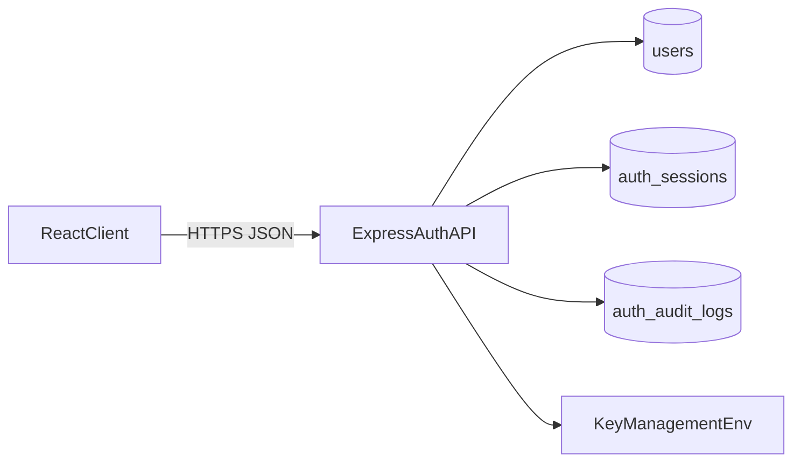
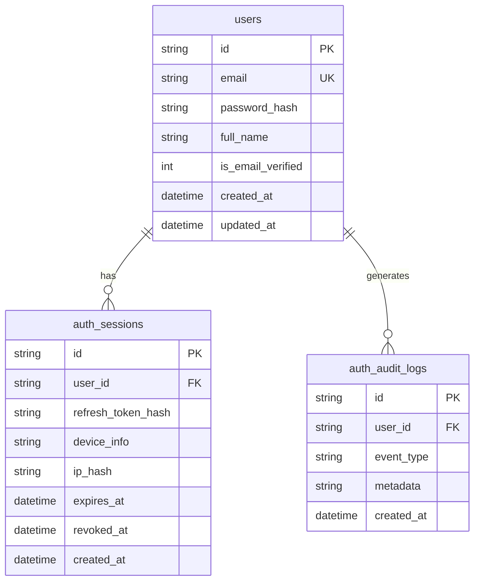

# Secure Auth Backend for Login/Signup

## Target Architecture

- Backend: Node.js + Express API in new folder `[Backend/](Backend/)`.
- Database: SQLite (your choice) with Prisma ORM for schema/migrations and safer query patterns.
- Auth model: access token (short-lived JWT) + refresh token (rotating, stored hashed in DB).
- Encryption baseline:
  - In transit: TLS/HTTPS required for all client-server traffic.
  - Secrets: passwords are **hashed** (Argon2id), never encrypted or reversible.
  - Sensitive server-side fields optionally encrypted at rest using application-level AES-256-GCM.

## Relational Database Design (SQLite)

- `users`
  - `id` TEXT PK (UUID)
  - `email` TEXT UNIQUE NOT NULL (normalized lowercase)
  - `password_hash` TEXT NOT NULL
  - `full_name` TEXT
  - `is_email_verified` INTEGER DEFAULT 0
  - `created_at`, `updated_at` DATETIME
- `auth_sessions` (refresh-token/session store)
  - `id` TEXT PK
  - `user_id` TEXT FK -> `users.id`
  - `refresh_token_hash` TEXT NOT NULL
  - `device_info` TEXT
  - `ip_hash` TEXT (hash IP for privacy)
  - `expires_at` DATETIME
  - `revoked_at` DATETIME NULL
  - `created_at` DATETIME
- `auth_audit_logs`
  - `id` TEXT PK
  - `user_id` TEXT FK -> `users.id`
  - `event_type` TEXT (`signup_success`, `login_failed`, `logout`, `login`etc.)
  - `metadata` TEXT (JSON)
  - `created_at` DATETIME

## Backend Implementation Details

- Project setup in `[Backend/](Backend/)`
  - `src/app.js`, `src/server.js`, `src/routes/auth.routes.js`, `src/controllers/auth.controller.js`, `src/services/auth.service.js`, `src/middleware/auth.middleware.js`, `src/lib/crypto.js`.
  - Packages: `express`, `prisma`, `@prisma/client`, `argon2`, `jsonwebtoken`, `zod`, `helmet`, `cors`, `cookie-parser`, `dotenv`, `rate-limiter-flexible`.
- API endpoints
  - `POST /api/auth/signup`
  - `POST /api/auth/login`
  - `POST /api/auth/refresh`
  - `POST /api/auth/logout`
  - `GET /api/auth/me`
- Security controls
  - Validate input with Zod.
  - Rate-limit login/signup.
  - Store refresh token in HttpOnly+Secure+SameSite cookie (preferred), or fallback to secure storage strategy if cookie policy differs.
  - Hash refresh tokens before DB storage.
  - Rotate refresh token on each refresh call.
  - Use Helmet and strict CORS allowlist for Vite origin.
- Encryption details
  - Traffic encryption: terminate TLS at reverse proxy (Nginx/Cloudflare/Render) or node runtime certs for local HTTPS test.
  - Passwords: Argon2id hash with tuned memory/time cost.
  - Optional field encryption (if required for PII): AES-256-GCM helper in `crypto.js` using `FIELD_ENCRYPTION_KEY`.

## Frontend Changes Required in `App`

- Replace mock auth in `[App/src/contexts/AuthContext.jsx](App/src/contexts/AuthContext.jsx)` with real API calls:
  - `login(email,password)` -> backend `POST /auth/login`
  - add `signup(payload)` for registration flow
  - add `fetchMe()` on app boot to restore session
  - keep `logout()` calling backend `POST /auth/logout`
- Update auth state bootstrapping
  - In `[App/src/main.jsx](App/src/main.jsx)` or context init, call `fetchMe()` before route render to avoid flicker.
- Update login hook
  - `[App/src/hooks/useLogin.js](App/src/hooks/useLogin.js)` should consume backend error codes/messages and surface field-level errors.
- Add signup UI
  - New `[App/src/components/auth/SignupView.jsx](App/src/components/auth/SignupView.jsx)` and route in `[App/src/App.jsx](App/src/App.jsx)`.
- API config
  - Add `VITE_API_BASE_URL` in frontend env and a small API client module (`fetch` wrapper with credentials included).

## Environment and Secrets

- Backend `.env`
  - `DATABASE_URL=file:./dev.db`
  - `JWT_ACCESS_SECRET`, `JWT_REFRESH_SECRET`
  - `ACCESS_TOKEN_TTL=15m`, `REFRESH_TOKEN_TTL=30d`
  - `FIELD_ENCRYPTION_KEY` (32-byte base64/hex if field encryption enabled)
  - `CORS_ORIGIN=http://localhost:5173`
- Frontend `.env`
  - `VITE_API_BASE_URL=http://localhost:4000/api`

## Testing and Verification Plan

- Unit tests: password hashing, token generation/verification, refresh rotation logic.
- Integration tests: signup/login/refresh/logout/me flows with SQLite test DB.
- Security checks:
  - no plaintext passwords/tokens in DB,
  - cookie flags set correctly in production,
  - expired/rotated refresh tokens rejected,
  - brute-force protection triggers correctly.

## Rollout Approach

1. Implement backend auth API + DB migrations.
2. Integrate frontend login with real endpoint.
3. Add signup UI + endpoint wiring.
4. Add refresh/me bootstrap for persistent sessions.
5. Run end-to-end auth tests and hardening checklist
