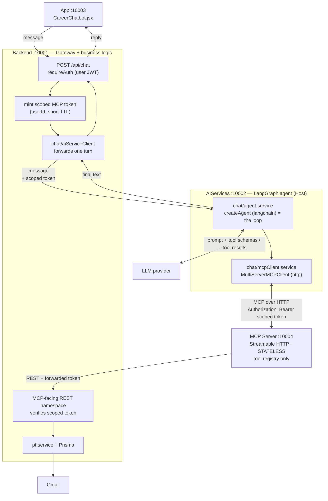

# In-App Chatbot with MCP Tools — Implementation Plan

> **Goal:** Turn `CareerChatbot` from a placeholder UI into a Claude-web-style assistant that
> uses an LLM to call StudentCarr's own tools through the Model Context Protocol (MCP).
>
> **Chosen architecture:** MCP server and MCP client both run inside our own infrastructure.
> The MCP server is a **standalone, stateless HTTP service** (a sidecar), not a stdio subprocess
> and not an in-process module. This keeps tools decoupled from the Backend and allows the
> two to be scaled independently behind a load balancer later.
>
> **Three tiers, not two.** The LLM agent loop (the "Host") does **not** run inside the
> `Backend` API process. It runs in `AIServices` (`:10002`), which already has a working
> LangGraph + OpenAI stack (see [§2](#2-current-state-inventory)). `Backend` stays a thin
> **auth gateway**: it authenticates the user, mints the scoped MCP token, rate-limits, and
> forwards one turn to `AIServices`. This isolates the slow, LLM-bound, cost-bearing workload
> from the fast CRUD/auth traffic Backend also serves, so a burst of chat traffic cannot starve
> unrelated endpoints — and lets the two tiers be scaled to different replica counts.
>
> **Out of scope:** Claude Desktop integration. The `.mcpb` bundle and `sc_` API key flow are
> retired (see [What Becomes Obsolete](#10-what-becomes-obsolete)).

---

## 1. Background: how this kind of chatbot actually works

MCP defines three roles, plus one role of our own (the gateway) that sits in front of the Host
because our Host is not internet-facing. Naming them explicitly avoids most of the confusion:

| Role | Who plays it here | Responsibility |
| --- | --- | --- |
| **Gateway** | `Backend` (`:10001`) | Authenticates the user, mints the scoped MCP token, rate-limits, forwards one turn |
| **Host** | `AIServices` (`:10002`) | Owns the LLM and drives the agent loop |
| **MCP Client** | A connector inside `AIServices` | Speaks MCP (`listTools`, `callTool`) to each server |
| **MCP Server** | `mcp-server` (`:10004`) | Publishes tool definitions and executes them |

The Host runs an **agent loop**:

1. On connect, the MCP client calls `listTools()` and receives tool names + JSON schemas.
2. A user message arrives at the Gateway, which authenticates it and forwards the turn to the
   Host. The Host calls the LLM with the conversation **plus the tool schemas**.
3. The LLM responds with either final text **or** a tool-call request (name + arguments).
4. On a tool call, the Host routes it through the MCP client → MCP server executes → result returns.
5. The result is appended to the conversation and the LLM is called again.
6. Repeat 3–5 until the model returns plain text, which travels back through the Gateway to the
   user.

The browser does **none** of this. It sends text and renders text. Every decision, secret, and
tool execution lives server-side, split across two internal services the browser never talks to
directly except through the Gateway — exactly like Claude web.

We do not hand-write the loop. `AIServices` already runs LangGraph in production for the
profile-generation pipeline (`AIServices/src/generate_user_infomation.ts` imports `StateGraph`
from `@langchain/langgraph`), so the chat agent reuses that same runtime instead of introducing
a second, competing LLM stack in Backend: **`createAgent` from the `langchain` package is the
loop**, and `@langchain/mcp-adapters` converts MCP tools into LangChain tools automatically.

> **Note (decided during Phase 4):** the original draft of this plan named `createReactAgent`
> from `@langchain/langgraph/prebuilt` as the loop. The installed `@langchain/langgraph@^1.0.0`
> already marks `createReactAgent` `@deprecated` in favor of `createAgent` from a separate
> `langchain` package — same parameter shape (`llm`, `tools`, `prompt`), same
> `.invoke({ messages })` return shape, so it is a near drop-in swap. This means Phase 4 adds
> one dependency to `AIServices` (`langchain`) that earlier phases of this plan didn't
> anticipate — see the Phase 4 task list and §2 for the version constraint.

---

## 2. Current state inventory

What already exists and how it will be reused.

### Frontend — `App/` (port 10003)

- **`App/src/components/layout/CareerChatbot.jsx`** — full chat UI. Critically, it was
  written with a single integration seam:
  - `requestAssistantReply(userText)` — currently returns a local placeholder after a
    `setTimeout`. **This is the only frontend function that must change.**
  - The component sends **only the message text** — no page/section context. It never had a
    `buildContext()` step; the frontend does not compute or forward `currentSection`/`path`.
    Any notion of "what the assistant should know about where the user is" is a **server-side
    concern**, resolved later via an MCP tool (see [§4.6](#46-pagesection-context-is-not-sent-by-the-frontend)),
    not a client-supplied payload field.
- **`App/src/lib/apiClient.js`** — `apiRequest(path, options, token)` helper, base URL
  `VITE_API_BASE_URL || http://localhost:10001/api`. New chat calls follow this pattern.
- **`App/src/lib/sseClient.js`** — `streamSseResponse`. The existing
  `profileManagementApi.generateManualProfileStream` is a **POST-with-token SSE stream**
  and is the exact precedent to copy for chat streaming in Phase 8.

### Backend — `Backend/` (port 10001)

- **`Backend/src/routes/index.js`** — mounts `/auth`, `/events`, `/profile-management`,
  `/process-tracking`, `/keys`, `/mcp`. The new chat route mounts here.
- **`Backend/src/middleware/auth.middleware.js`** — `requireAuth` verifies the access JWT and
  sets `req.user` (full user record, including `id`).
- **`Backend/src/lib/token.js`** — `jsonwebtoken` sign/verify helpers. The scoped MCP token
  in Phase 2 follows this pattern.
- **`Backend/src/config/env.js`** — central env object. Note the existing
  `progressTrackingServiceBaseUrl` (`http://127.0.0.1:10002`) — **the MCP service URL follows
  this same convention.**
- **`Backend/src/mcp/`** — `mcp.service.js` holds `runService(userId, message)` and the
  `MESSAGE_HANDLER` map (`getEmails` → `getEmailsHandler`). **This business logic survives**;
  only the routing/auth wrapper around it changes.
- **`Backend/src/processTracking/pt.service.js`** — the real work
  (`syncProgressTrackingForUser`, `listApplicationsForUser`, `listEmailsForApplication`,
  `getEmailDetailById`). It already calls `AIServices` over loopback HTTP with **no auth
  header at all** (`AI_BASE_URL` = `env.progressTrackingServiceBaseUrl`, plain `fetch`,
  `requestAiService()`). **This is the existing convention the Backend→AIServices chat call
  follows** — no new internal auth mechanism needs to be invented.
- **`Backend/src/middleware/rateLimit.middleware.js`** — reused in Phase 9.

### AIServices — `AIServices/` (port 10002) — becomes the chat Host

This service is not a placeholder: it already runs a real LangGraph + OpenAI stack and is the
natural home for the agent loop.

- **`src/server.ts`** — a plain `node:http` server (no Express, no auth), listening on
  `LANGGRAPH_PORT` (default `10002`), bound implicitly to `127.0.0.1` in dev. Currently exposes
  `GET /health`, `POST /generate-profile`, `POST /progress-tracking/sync`,
  `POST /progress-tracking/reply-draft`, `POST /progress-tracking/send-reply`. **The chat routes
  (`POST /chat/turn`, later `POST /chat/stream`) are added here, following the same
  parse-body/`writeJson` pattern.**
- **`src/generate_user_infomation.ts`** — already imports `StateGraph`, `Annotation`, `START`,
  `END` from `@langchain/langgraph` and `ChatOpenAI` / `OpenAIEmbeddings` from
  `@langchain/openai`, reading `OPENAI_MODEL` / `OPENAI_API_KEY` / `OPENAI_BASE_URL` from env.
  **The chat agent reuses this exact model-client setup** instead of adding a second LLM
  provider configuration in Backend.
- **`package.json`** — already depends on `@langchain/langgraph`, `@langchain/openai`,
  `@langchain/core`, `@langchain/community`. Phase 4 adds `langchain` (the agent loop's home —
  see §1's note; pin to a version peer-compatible with the installed `@langchain/core` range,
  e.g. `^1.4.x` against `@langchain/core@^1.1.48` — check before bumping either), and Phase 5
  adds `@langchain/mcp-adapters`.
- No auth exists in this service today (by design — it is only ever called from Backend, never
  from the browser). The chat design keeps that: `AIServices` never verifies the user's login
  JWT; it only forwards the already-minted scoped MCP token when it talks to `mcp-server`.

### MCP server — `mcp-server/` (will run on port 10004)

- **`src/index.js`** — currently `StdioServerTransport`, and hard-exits at boot if
  `STUDENTCARR_API_KEY` / `STUDENTCARR_API_URL` are missing.
- **`src/tools/index.js`** — tool registry (`toolDefinitions`, `getHandler`). Good structure, keep it.
- **`src/tools/processTrack.js`** — one tool, `process_track`, taking a free-text `message` tag.
- **`src/apiClient.js`** — HTTP wrapper calling back into the Backend with a Bearer key.
  **This layer is architecturally correct for our chosen design** — only its auth changes.

### Existing service map

| Service | Port | Notes |
| --- | --- | --- |
| Backend | 10001 | Express API — becomes the chat **Gateway** (auth, token minting, rate limiting) |
| AIServices | 10002 | `LANGGRAPH_PORT`, already running LangGraph + OpenAI — becomes the chat **Host** |
| App (Vite) | 10003 | Frontend dev server |
| **MCP server** | **10004** | **New** — next free port |

`start-all-services.bat` launches the first three and must gain a fourth entry.

---

## 3. Target architecture



### Two invariants that keep this maintainable

1. **The MCP server holds zero business logic and zero database access.** It is a tool catalog
   and protocol adapter. Every tool handler is a thin HTTP call into the Backend.
2. **The Backend remains the single source of truth** for data, permissions, and domain rules —
   and the only auth boundary. `AIServices` never sees the user's login JWT and never touches
   Prisma; it only receives a message and a short-lived scoped token per turn.

These rules are what make independent deployment and scaling possible. If tool handlers start
querying Prisma directly, or `AIServices` starts verifying user logins itself, the decoupling is
lost. `AIServices` is a **compute tier**, in the same category as the MCP server — not a second
place that owns data or identity.

### Request lifecycle for one chat turn

```
User types
  └─> POST /api/chat  { message, threadId? }   [user JWT]
        └─> requireAuth → req.user.id
              └─> mint scoped MCP token (userId, ~2 min TTL)
                    └─> Backend calls AIServices :10002 POST /chat/turn
                          { message, token }
                          └─> get/create cached MCP client for this user
                                └─> agent loop starts
                                      ├─ LLM(history + tool schemas)
                                      ├─ tool call? ──no──> final text ──> response
                                      └─ yes
                                           └─> MCP client.callTool()
                                                 └─> HTTP :10004 /mcp
                                                       └─> tool handler
                                                             └─> HTTP :10001 REST (scoped token)
                                                                   └─> pt.service → Gmail
                                                 <── result appended to history, loop again
                    <── AIServices returns { reply } to Backend
        <── Backend returns { reply } to the browser
```

Note the extra hop versus a two-tier design (Backend ↔ AIServices, in addition to Backend ↔
MCP server ↔ Backend). That is the deliberate cost of isolating the LLM-bound workload — the
same trade already accepted for making the MCP server a separate sidecar in the first place.

---

## 4. Key design decisions

### 4.0 Why the agent Host lives in AIServices, not Backend

The Backend API also serves login, session refresh, profile CRUD, and file uploads — traffic
that must stay fast and cheap regardless of chat load. The agent loop is the opposite profile:
each turn can take seconds, may fan out into several sequential tool calls, and costs real money
per LLM call. Running both in the same Node process means a burst of chat traffic competes for
the same event loop and connection pool as unrelated, latency-sensitive requests, and forces you
to scale the whole Backend (including all its auth/CRUD logic) just to absorb more chat
concurrency.

Splitting them into two tiers means:

- **Backend** stays small and fast: `requireAuth`, mint token, rate-limit, proxy. Rate limiting
  happens *before* any LLM cost is incurred, so abusive traffic is rejected cheaply.
- **AIServices** absorbs the slow/expensive part and can be scaled (replica count, concurrency
  limits, even hardware) independently, matching LLM cost/latency needs rather than API needs.
- **No duplicate LLM stack.** `AIServices` already has `@langchain/langgraph` and
  `@langchain/openai` wired up and working (see [§2](#2-current-state-inventory)); building the
  agent there reuses that investment instead of adding a whole second LangChain + provider
  package install to Backend and running two different agent frameworks in two services. (Phase
  4 does add the `langchain` package itself to `AIServices` — see §1's note — but that is one
  dependency in the tier that already owns the LLM stack, not a second stack in Backend.)

This is the same reasoning §4.1 below already applies to the MCP server, extended one tier
further: isolate the workload that needs independent scaling, and keep the API gateway thin.

### 4.1 Why a separate HTTP service instead of stdio or in-process

| | stdio subprocess | in-process (in-memory transport) | **HTTP sidecar (chosen)** |
| --- | --- | --- | --- |
| Decoupled deploy | No | No | **Yes** |
| Horizontally scalable | No | Tied to Backend | **Yes** |
| Reusable by AIServices | Awkward | No | **Yes** |
| Latency | Medium | Lowest | Low (loopback) |
| Ops complexity | Medium | Lowest | Medium |

Chosen for growth: more tools are coming, and tools should scale independently of the API.

### 4.2 Stateless mode is mandatory

Streamable HTTP MCP servers can run **stateful** (session ID + long-lived SSE streams) or
**stateless** (each request self-contained).

**We run stateless.** Stateful mode requires sticky sessions or a shared session store the
moment a load balancer is introduced. Stateless means scaling is just "run N replicas."
This decision must be made now — retrofitting it later is painful.

### 4.3 Auth: replace the `sc_` API key with a short-lived scoped token

The long-lived per-user API key existed only because an external program (Claude Desktop)
needed to authenticate inbound. It is wrong for our own service:

- We cannot store raw keys (the current design deliberately stores only a SHA-256 hash).
- Long-lived credentials are hard to revoke and rotate.

**New flow:** per chat request the Backend mints a short-lived JWT carrying the user identity.

```
Claims:  { sub: <userId>, typ: "mcp", aud: "studentcarr-mcp", iat, exp }
Secret:  env.mcpTokenSecret          (separate from access/refresh secrets)
TTL:     ~2 minutes (long enough for one agent turn, including tool calls)
```

- Backend mints this token and includes it in the body it sends to `AIServices`
  (`POST /chat/turn`). `AIServices` treats it as an opaque string — it never verifies it, it
  only forwards it.
- The MCP client (now inside `AIServices`) sends it as `Authorization: Bearer <token>`.
- The MCP server **verifies the signature and `typ`/`aud`**, extracts `sub` as the userId,
  and forwards the same token on its REST calls back to the Backend.
- The Backend's MCP-facing routes verify it with a dedicated middleware
  (analogous to `requireAuth`, but for `typ: "mcp"`).

Properties: nothing long-lived is stored, expiry gives automatic revocation, and verification
is stateless so it works identically across N replicas of any tier.

**Security rule:** `userId` is derived **only** from the verified token. It must never be a
tool argument the LLM can supply, or a model could request another user's data.

### 4.4 Client construction caveat

`MultiServerMCPClient` sets headers at **construction time**. A per-user token therefore means
a per-user client instance. This client now lives in `AIServices/src/chat/mcpClient.service.ts`
(not Backend). Implement a small cache keyed by userId, with entries expiring slightly before
the token does. Do not use a single global client.

### 4.5 Backend ↔ AIServices trust: plain loopback, no new secret

`Backend/src/processTracking/pt.service.js` already calls `AIServices` over unauthenticated
loopback HTTP (`AI_BASE_URL` from `env.progressTrackingServiceBaseUrl`, plain `fetch`, no
header). The chat Gateway→Host call follows the **same existing convention** rather than
inventing a new internal-service credential:

- `AIServices` binds to `127.0.0.1` (as it already implicitly does in dev), so it is not
  reachable from outside the host/container it runs on — the browser can never reach it directly.
- The only credential that travels with the request is the scoped MCP token, which is opaque to
  `AIServices` and meaningful only to `mcp-server` and Backend's own MCP-facing routes.
- If `AIServices` is ever deployed on a separate machine from Backend (not the case today), this
  is the point where a shared internal secret or mTLS should be added — call it out explicitly
  rather than silently relying on network isolation at that point.

### 4.6 Page/section context is not sent by the frontend

Earlier drafts of this plan had `CareerChatbot.jsx` compute `{ currentSection, path }` via
`useLocation()`/`getSectionMeta()` and send it with every turn (a `buildContext()` step), and
had `AIServices` fold that into the system prompt (old Phase 4). **This is dropped.** The chat
payload from the browser is just `{ message }` (plus `threadId` once Phase 7 lands) — no client
computed context field, ever.

Reasoning: a client-supplied page path is a weak, easily-stale signal (the model does not know
what a route name actually means), and it couples the frontend to the prompt-building logic.
Instead, whatever contextual grounding the assistant needs — what section of the app is
relevant, what the user is currently looking at, what data applies — is resolved **server-side**,
the same way every other fact the model needs is resolved: **by calling an MCP tool.** This is
architecturally consistent rather than special-cased: "what page context applies" becomes just
another tool the agent can call when it decides it's relevant, subject to the same catalog
design as any other tool (§6 Phase 6 — naming, schema, token budget).

The concrete shape of that tool (e.g. a `get_current_context` tool, or folding page awareness
into existing/future data tools) is **not decided yet** — it ships in a later round, once the
MCP tool catalog work resumes. Until then, the chatbot is a plain conversational assistant with
no page awareness, which is an accepted, intentional gap for the phases in between.

---

## 5. New module layout

Nothing existing is deleted in the early phases; this is additive.

```
Backend/src/chat/
  index.js              # exports the router
  chat.routes.js        # POST /api/chat  (+ /api/chat/stream in Phase 8)
  chat.controller.js    # request validation, mints scoped token, calls AIServices, shapes response
  chat.schemas.js       # zod schemas (matches the mcp.schemas.js convention)
  aiServiceClient.js    # thin HTTP client → AIServices /chat/turn (mirrors pt.service's AI_BASE_URL client)
  mcpToken.js           # mint/verify the scoped MCP token

Backend/src/middleware/
  mcpTokenAuth.middleware.js   # verifies typ:"mcp" tokens on the MCP-facing REST routes

AIServices/src/chat/
  index.ts              # POST /chat/turn (+ /chat/stream in Phase 8) handlers, wired into server.ts
  agent.service.ts      # createAgent (langchain package) + system prompt + loop invocation
  mcpClient.service.ts  # MultiServerMCPClient lifecycle + per-user cache

mcp-server/src/
  index.js              # HTTP bootstrap (replaces stdio bootstrap)
  server.js             # buildServer() factory — registers tools, no transport
  http.js               # stateless Streamable HTTP transport handling + /health
  apiClient.js          # unchanged shape; auth switches to forwarded scoped token
  tools/                # registry unchanged; catalog grows here
```

---

## 6. Phased plan

Each phase is independently verifiable. **Do not skip the exit criteria** — several phases
exist specifically to de-risk the next one.

### Phase 1 — Transport swap: stdio → stateless Streamable HTTP

**Why first:** everything downstream depends on the MCP server being reachable over HTTP.

Tasks:
- Extract server construction into `buildServer()` in `mcp-server/src/server.js` — registers
  `ListToolsRequestSchema` / `CallToolRequestSchema` handlers, returns an unconnected server.
  Transport selection moves out of it.
- Add `mcp-server/src/http.js`: an HTTP listener exposing `POST /mcp` using the SDK's
  Streamable HTTP server transport in **stateless** mode, plus `GET /health`.
- Remove the boot-time `STUDENTCARR_API_KEY` / `STUDENTCARR_API_URL` hard-exit in `index.js`.
  Auth now arrives **per request**; the API base URL becomes ordinary config
  (`STUDENTCARR_API_URL`, default `http://127.0.0.1:10001`).
- Listen on `MCP_PORT` (default **10004**), bound to `127.0.0.1` in development.
- Update `mcp-server/package.json`: description, `start`/`dev` scripts. The `bin` entry and
  `.mcpb` packaging are no longer needed.
- Add a fourth line to `start-all-services.bat` for the MCP service.
- Add `MCP_SERVER_URL` (default `http://127.0.0.1:10004`) to `AIServices`'s env — **not**
  Backend's — since it is `AIServices`'s MCP client that will call `mcp-server` directly
  (see Phase 5). This mirrors the `progressTrackingServiceBaseUrl` convention one tier over.

**Exit criteria:** `GET :10004/health` returns OK, and MCP Inspector connects over HTTP and
lists `process_track`. Two sequential `listTools` calls succeed with **no session ID**,
proving statelessness.

---

### Phase 2 — Auth redesign: scoped MCP token

Tasks:
- Add `mcpTokenSecret` and `mcpTokenTtl` to `Backend/src/config/env.js`.
- `Backend/src/chat/mcpToken.js` — `signMcpToken(userId)` / `verifyMcpToken(token)`
  following the `Backend/src/lib/token.js` pattern, with `typ: "mcp"` and an `aud` claim.
- `Backend/src/middleware/mcpTokenAuth.middleware.js` — verifies the token, rejects tokens
  whose `typ` is not `"mcp"`, sets `req.user = { id: payload.sub }`.
- Swap `Backend/src/mcp/mpc.routes.js` from `requireApiKeyAuth` to the new middleware.
- In `mcp-server/src/apiClient.js`, take the caller's token from the MCP request context
  instead of reading `process.env.STUDENTCARR_API_KEY`, and forward it as the Bearer token.
  Keep the existing status-code → friendly-message mapping (401/403/other), adjusting the
  401 text (no longer "generate a new key in the web app").
- In `mcp-server`, extract and verify (or at minimum read) the incoming `Authorization` header
  per request and thread it through to tool handlers.

**Exit criteria:** using a manually minted token, an MCP Inspector `callTool` on
`process_track` executes as the correct user and returns real data, with **no `sc_` key
anywhere in the path**. A token with a wrong/absent `typ` is rejected with 401.

**Security check:** confirm no tool input schema accepts a user ID.

---

### Phase 3 — Chat endpoint skeleton (no AI, no AIServices yet)

**Why:** proves auth, routing, CORS, and the frontend seam before any LLM variable is introduced.
This phase deliberately stays entirely inside Backend — `AIServices` isn't touched until Phase 4.

Tasks:
- Create `Backend/src/chat/` with `chat.routes.js`, `chat.controller.js`, `chat.schemas.js`.
- Mount in `Backend/src/routes/index.js`: `router.use("/chat", requireAuth, chatRoutes);`
- `POST /api/chat` accepts `{ message }` (no `context` field — see §4.6), returns
  `{ success: true, data: { reply: "<hardcoded>" } }` in the project's standard envelope.
- Add `chatApi.send(body, token)` to `App/src/lib/apiClient.js`.
- Replace the body of `requestAssistantReply` in `CareerChatbot.jsx` (now `(userText)`, no
  context argument) with a call to it. **Do not restructure the component** — it was designed
  for exactly this swap. Add error handling so a failed request renders a message instead of
  leaving the panel stuck (note the existing `finally` block already resets `isThinking`).

**Exit criteria:** typing in the panel round-trips through the Backend with the correct
`req.user.id`, and the hardcoded reply appears in the UI.

---

### Phase 4 — LLM in the loop in AIServices, no tools yet

**Why AIServices, not Backend:** it already has `@langchain/langgraph` and `@langchain/openai`
installed and configured (`OPENAI_MODEL`, `OPENAI_API_KEY`, `OPENAI_BASE_URL` — see
`generate_user_infomation.ts`). No new LLM stack needs to be added to Backend at all.

Tasks:
- Add `langchain` to `AIServices/package.json` (pin peer-compatible with the installed
  `@langchain/core@^1.1.48` — e.g. `^1.4.x`, not `^1.5.x`, which requires
  `@langchain/core@^1.2.9`; check `npm view langchain@<version> peerDependencies` before
  picking a version if this drifts). `langchain@^1.4.x` also depends on
  `@langchain/langgraph@^1.3.x`, which overlaps with the existing `^1.0.0` range in
  `package.json` — no need to bump that line, `npm install` resolves a single shared version.
- `AIServices/src/chat/agent.service.ts`: `createAgent({ llm, tools: [] })` from the
  `langchain` package (not `createReactAgent` from `@langchain/langgraph/prebuilt` — that
  export is deprecated in the installed LangGraph version in favor of this one; see §1's
  note), reusing the existing `ChatOpenAI` construction pattern.
- Add `POST /chat/turn` to `AIServices/src/server.ts`, following the existing raw-`http`
  `parseRequestBody`/`writeJson` pattern used by the other routes there. Accepts
  `{ message }`, returns `{ success: true, data: { reply } }`.
- `Backend/src/chat/aiServiceClient.js`: a thin `fetch` wrapper calling
  `${env.progressTrackingServiceBaseUrl}/chat/turn` (reuse the existing config value — it
  already points at `AIServices`), mirroring `pt.service.js`'s `requestAiService()` helper.
- `Backend/src/chat/chat.controller.js` swaps its hardcoded reply for a call to
  `aiServiceClient`. **The LLM key lives only in `AIServices`** and is never exposed to
  Backend or the frontend.
- Build the system prompt in `AIServices` from a short, static description of what StudentCarr
  is and what the assistant is for. There is no page/section context to fold in (§4.6) — that
  arrives later as an MCP tool the model can call, not as a prompt-time payload field.

**Exit criteria:** a genuine conversational reply, round-tripping through Backend → AIServices
and back, for a page-agnostic question (e.g. "how should I structure my resume?").

---

### Phase 5 — Connect the agent to MCP (the milestone)

Tasks:
- Add `@langchain/mcp-adapters` to `AIServices/package.json` (the only new dependency this
  phase needs — `langchain` itself was already added in Phase 4).
- `AIServices/src/chat/mcpClient.service.ts`: build a `MultiServerMCPClient` with

  ```
  studentcarr: {
    transport: "http",
    url: `${env.MCP_SERVER_URL}/mcp`,
    headers: { Authorization: `Bearer ${scopedToken}` },
  }
  ```

  where `scopedToken` is the token Backend included in the `/chat/turn` request body — Backend
  mints it (§4.3), `AIServices` only forwards it and never verifies it.
- Per-user client cache (see §4.4), with `close()` on eviction — this cache now lives in
  `AIServices`.
- `const tools = await client.getTools()` → pass into `createAgent`.
- Cap the loop with LangGraph's `recursionLimit` so a confused model cannot loop forever
  (`CHAT_MAX_STEPS`, passed through from Backend or mirrored in `AIServices`'s own env).

**Exit criteria:** "show me my latest job application emails" causes a real `getEmails`
execution (observable in Backend **and** AIServices logs across all three hops) and produces a
grounded answer citing actual data. A second turn in the same conversation still works after the
first token expires. Confirm Backend never calls `mcp-server` directly — only `AIServices` does.

---

### Phase 6 — Grow the tool catalog properly

This is where the design must change to support many tools. Two problems with today's shape.

> **Note (revised after reading the code as it stands).** This section was originally written
> before `get_user_profile` existed. Problem A is now **half-solved**, Problem B is untouched,
> and Problem B's original description is wrong on one point — the handler does not sync. The
> text below reflects the current code.

**Problem A — the free-text tag dispatcher.** `process_track` takes `message: "getEmails"` and
routes through `MESSAGE_HANDLER`. That was fine as a shim for one external tool, but LLMs
select tools by **name and description**. A single tool hiding N behaviours behind a magic
string will be chosen unreliably and cannot express per-behaviour input schemas.

*Already fixed:* the pattern this phase wants exists and works. `get_user_profile`
(`mcp-server/src/tools/getProfile.js`) is a distinctly-named tool with its own Backend route
`POST /api/mcp/profile` → `mcpProfile` → `getManualProfile`; it never touches the dispatcher,
and `mpc.routes.js:13-14` already carries the one-route-per-tool comment. Separately, the magic
string is no longer **model-facing**: `processTrack.js:6` hardcodes `ROUTING_TAG` and exposes an
empty `inputSchema`, so "the LLM picks the wrong tag" is no longer a failure mode.

*Still to do:* `process_track` still posts `{ message: "getEmails" }` to `POST /api/mcp` and
routes through `MESSAGE_HANDLER` (`mcp.service.js:117-130`) — a one-entry router duplicating
what Express already does. And one coarse tool still covers the whole progress-tracking domain,
with no way to ask for a single application, a single email, or a filtered subset.

*Action:* split into distinct, individually-schema'd tools (see the catalog below), each with a
description written **for a model, not a human** — when to use it and what it returns. Then
delete `MESSAGE_HANDLER`, `mcpDispatcher`, `mcpDispatcherSchema`, and `POST /api/mcp` outright.
Verified safe: `mcp-server/src/tools/processTrack.js:21` is the only caller of that route in the
repo (`McpSetupView.jsx:114` merely names the path in a comment).

**Problem B — response size will overflow the context window.** `getEmailsHandler`
(`mcp.service.js:46-84`) lists every application, collects every root email id, and calls
`getEmailDetailById` per email. Each result is `mapEmailDetail`, whose `body` is `toMessageBody`
= `rawBodyHtml || rawBodyText || snippet` (`pt.service.js:120`) — **raw HTML wins whenever it
exists** — and which embeds the full `replies` array, each reply carrying its own raw HTML body
(`pt.service.js:175`). The cost is therefore emails × thread depth, paid in markup rather than
prose. `stripHtml` exists at `mcp.service.js:12` but is wired only into the profile path.

Correction to the original text: the handler does **not** sync. It is deliberately read-only —
see the comment at `mcp.service.js:43-45` and `process_track`'s own description. The per-email
`getEmailDetailById` call is an N+1, but that is a latency/DB concern rather than a
context-window one; it disappears as a side effect of the new service function below.

*Action — summary-first responses.* List tools return **no message body at all**. They return
the stored AI-derived fields instead: `summary`, `intent`, `companyName`, `positionTitle`,
`contactEmail`, alongside `sender`, `subject`, `date`, `replyCount`.

This is safe because the summary is part of the sync contract rather than an occasional
enrichment: `pt.service.js:606-638` upserts a `ProgressEmailIntelligence` row for **every**
persisted email, unconditionally, in the same transaction as the email record. One caveat —
`summary` is `String?` (`schema.prisma:390`), written as `normalizeText(extraction.summary) ||
null`, so the row always exists but the field can be null when extraction produced nothing.
**Fall back to `snippet`** (already stored, short by construction), never to `rawBodyHtml`.

Net effect: per-email cost drops from thousands of tokens of markup to tens of tokens of prose,
and HTML stripping leaves the list path entirely. On top of that:
- pagination (`limit`, `cursor`) with sane defaults,
- filters (by application, intent),
- a separate detail tool the model calls for the one item it actually needs,
- strip HTML **and** quoted reply chains on the one path that still returns a body.

#### Target catalog

| Tool | Replaces | Returns | Backend route |
| --- | --- | --- | --- |
| `list_applications` | part of `process_track` | one row per application, no emails | `POST /api/mcp/applications` |
| `list_application_emails` | part of `process_track` | summary-shaped emails, paginated | `POST /api/mcp/emails` |
| `get_email_detail` | — (new) | one email + thread, bodies stripped | `POST /api/mcp/emails/detail` |
| `get_user_profile` | unchanged | unchanged | `POST /api/mcp/profile` |

- **`list_applications`** — empty input schema. Returns `{ hasRecords, applications: [{ id,
  companyName, positionTitle, status, lastUpdatedAt, emailCount }] }`, `emailCount` via Prisma
  `_count` rather than a second query. The cheap orientation call: use it first, then drill in.
- **`list_application_emails`** — optional `applicationId`, optional `intent`, `limit`
  (default 20, max 50), `cursor`. Returns `{ hasRecords, emails: [...], nextCursor }`, each
  email carrying the summary-shaped fields above and **no `body`**.
- **`get_email_detail`** — required `emailId`. The **only** place a message body is reachable,
  one email at a time, with every body (root and each reply) HTML-stripped *and*
  quoted-chain-trimmed. It exists because summaries reliably drop specifics ("what time did they
  propose?", "what should I bring?"); bounding it to one email is what makes that safe.

**Deliberately not added: `sync_mailbox`.** Earlier drafts of this section listed it. The
current design is explicitly read-only — `process_track` promises it "never scans Gmail and
never changes the user's data", and `mcp.service.js:43-45` states that only the Sync button
writes. A sync tool is side-effecting and belongs behind the approval-gate pattern deferred to
Phase 9. Keep this catalog read-only.

#### Backend service work

`listEmailsForApplication` requires an `applicationId`, so it cannot serve
`list_application_emails` when that argument is omitted. Add one function to `pt.service.js`:
`listEmailSummariesForUser(userId, { applicationId, intent, limit, cursor })` — a single query
over `progressEmail` where `{ userId, parentEmailId: null }`, with `include: { intelligence:
true, _count: { select: { childReplies: true } } }`, ordered `receivedAt` / `sentAt` /
`createdAt` desc plus a trailing `{ id: "asc" }` tiebreaker (required for stable cursor
pagination), taking `limit + 1` to compute `nextCursor` and adding `cursor: { id: cursor },
skip: 1` when a cursor is supplied. This replaces the fan-out and removes the N+1.

Add `stripQuotedChain(text)` beside the existing `stripHtml` in `mcp.service.js`: cut at the
first of a line beginning `>`, `On <date> … wrote:`, `-----Original Message-----`, or the
contents of `blockquote.gmail_quote` / `div.gmail_quote`. Apply after `stripHtml`, then the
char cap.

**Ownership checks already exist and are correct** — `listEmailsForApplication` 404s when the
application is not the user's, and `getEmailDetailById` uses `findFirst` scoped by `userId`.
Preserve that: `applicationId` and `emailId` are legitimate tool arguments, but every query
using them must stay scoped by `userId` so a guessed or hallucinated id cannot reach another
user's row. Per §4.3, no tool input schema may contain a user identifier.

**Exit criteria:** at least two distinct tools exist and the model reliably picks the right one;
no list-tool response contains a raw HTML body; no single tool response exceeds the agreed token
budget, measured on a real account with the largest thread available; and `MESSAGE_HANDLER` and
`POST /api/mcp` no longer exist anywhere in the repo.

**Also decide here:** the page/section-context tool deferred in §4.6. Once real tools exist,
settle whether "what is the user currently looking at" becomes its own tool (e.g.
`get_current_context`) or is folded into the relevant data tools' descriptions so the model
infers it from what it's asked. This was deliberately left open when the frontend stopped
sending `{ currentSection, path }` — see §4.6. **Still undecided.**

---

### Phase 7 — Conversation memory

Currently `CareerChatbot` holds messages only in React state and sends one turn.

`AIServices` stays a stateless compute tier by design (§4.0/§3 invariants) — it must not grow
its own database or its own notion of "threads." So even with persisted history, **Backend
remains the store**:

Options: client-sends-history (simple, stateless) versus Prisma-persisted threads (survives
refresh, better multi-turn tool reasoning, and **any Backend or AIServices replica can serve any
turn** — which matters given the scaling goal). Recommended: persist threads in Backend, keyed
by `threadId`; Backend loads the recent history and includes it in each `/chat/turn` call to
`AIServices`, rather than `AIServices` fetching or storing it itself. LangGraph's checkpointer
(if used) is scoped to *intra-turn* tool-loop state only, not cross-turn memory.

**Constraint — replayed tool results must not become stale facts.** Whichever storage option is
chosen, persist and replay **only the human messages and each turn's final assistant text** (the
message with no `tool_calls`). Every tool call and every tool result is dropped from history.

Tool results are snapshots of tables that keep changing, but once they sit in the replayed
context they read as facts. On a later turn the model sees that it already "knows" the user's
applications, skips the tool call, and answers from data captured several turns earlier — after
a sync may have changed it. A system-prompt instruction to "re-call the tool when data might
have changed" is *not* the fix: it depends on exactly the kind of model judgment Phase 6 already
assumes is unreliable (the same reasoning that retires the `process_track` tag dispatcher).
Removing the stale data from context is what enforces it — with no cached rows to reuse, the
only route to application data is a fresh tool call against the current database.

This bug does not exist before this phase. `runChatTurn` currently passes only
`[new HumanMessage(message)]`, so every turn starts blank and always re-calls; the bug is
introduced by the obvious implementation of this phase.

Two consequences worth planning for:

- **Never persist an `AIMessage` carrying `tool_calls` without its matching tool-result
  message** — the replayed history is malformed and the provider rejects the request. Storing
  one human message plus one final text reply per turn avoids this by construction.
- This is also the largest token saving available in this phase. Tool results are by far the
  biggest thing in a thread, so history stays cheap however long a conversation runs — the same
  goal as Phase 6's response budget, one layer up.

Add one system-prompt line as a **backstop, not the mechanism**: "Earlier turns do not contain
live data. Whenever a question depends on the user's applications or emails, call the tool again
rather than relying on anything stated earlier."

**Exit criteria:** "summarize the second one" resolves correctly against the previous turn,
history survives a page refresh, and a value changed directly in the database between two turns
is reflected in the second answer — proving the model re-called the tool instead of reusing a
replayed result.

---

### Phase 8 — Streaming

Tasks:
- `AIServices` exposes `POST /chat/stream`, using the agent's streaming API to emit SSE: token
  deltas plus tool-status events (`tool_start` / `tool_end`).
- Backend's `POST /api/chat/stream` **proxies** that stream through to the browser rather than
  generating tokens itself — it re-emits what `AIServices` sends, after having already
  authenticated the request and minted the scoped token.
- Follow the existing precedent exactly for the Backend→browser leg:
  `profileManagementApi.generateManualProfileStream` in `App/src/lib/apiClient.js` already does
  POST-with-token SSE via `streamSseResponse` (`App/src/lib/sseClient.js`).
- Replace the `isThinking` placeholder in `CareerChatbot.jsx` with incremental rendering.

**Exit criteria:** tokens appear progressively and tool activity is visible while it happens,
across both the AIServices→Backend and Backend→browser hops.

---

### Phase 9 — Hardening and scale readiness

- **Loop safety:** max tool-call steps, per-tool timeout, overall request timeout — including a
  timeout on Backend's call to `AIServices` (separate from `AIServices`'s own per-tool timeout).
- **Rate limiting:** per-user limits on `/api/chat` via `rateLimit.middleware.js`, enforced in
  **Backend before** the request ever reaches `AIServices` (LLM calls cost real money — this is
  not optional, and rejecting early avoids spending that cost).
- **Error surfacing:** tool failures should return a clear message *to the model* so it can
  recover or explain, rather than throwing and killing the turn. The existing 401/403 mapping
  in `apiClient.js` is a good template.
- **Connection reuse:** HTTP keep-alive on both internal hops — Backend → AIServices and
  AIServices → MCP service.
- **LB readiness:** `/health` already exists on `AIServices` and is planned for the MCP service;
  graceful shutdown (drain in-flight requests) on both.
- **Tracing:** propagate a request ID from `/api/chat` → `AIServices` → MCP server → Backend
  REST, so one tool call can be traced across all four hops.
- **Approval gates:** any future side-effecting tool (e.g. sending an email — note
  `sendInviteReply` already exists in AIServices) must require explicit user confirmation
  before execution. Decide the pattern before such a tool ships.

---

## 7. Configuration summary

**`Backend/src/config/env.js` additions**

| Key | Env var | Default |
| --- | --- | --- |
| `mcpTokenSecret` | `MCP_TOKEN_SECRET` | dev fallback, must be set in prod |
| `mcpTokenTtl` | `MCP_TOKEN_TTL` | `2m` |
| `chatMaxSteps` | `CHAT_MAX_STEPS` | `8` (forwarded to `AIServices` per request) |

`progressTrackingServiceBaseUrl` (already present, default `http://127.0.0.1:10002`) is reused
as-is for the Backend → AIServices chat call — no new "AI service URL" config is needed.

**`AIServices` environment additions** (alongside its existing `LANGGRAPH_PORT`,
`OPENAI_MODEL`, `OPENAI_API_KEY`, `OPENAI_BASE_URL`, etc.)

| Env var | Default | Purpose |
| --- | --- | --- |
| `MCP_SERVER_URL` | `http://127.0.0.1:10004` | mcp-server origin, used by the MCP client |
| `CHAT_MAX_STEPS` | `8` | Recursion/step cap for the agent loop |

**`mcp-server` environment**

| Env var | Default | Purpose |
| --- | --- | --- |
| `MCP_PORT` | `10004` | Listen port |
| `MCP_HOST` | `127.0.0.1` | Bind address |
| `STUDENTCARR_API_URL` | `http://127.0.0.1:10001` | Backend origin (no `/api` suffix) |
| `MCP_TOKEN_SECRET` | — | Shared with Backend, for token verification |

---

## 8. Testing strategy

- **MCP server in isolation:** MCP Inspector against `:10004`. Verifies tools without the LLM
  in the way — invaluable during Phases 1, 2, and 6.
- **Backend chat endpoint:** integration tests following the existing
  `Backend/tests/*.e2e.test.js` pattern, with `AIServices` stubbed at the `aiServiceClient`
  boundary (mirroring how `pt.service.js` tests already stub calls to `AIServices`) so tests
  are deterministic and don't depend on a running LLM.
- **Agent loop (in AIServices):** stub the model to return a scripted tool call, and assert the
  tool executed and the result re-entered the conversation.
- **Auth boundary:** assert an expired token, a wrong-`typ` token, and a missing token are all
  rejected, and that user A can never reach user B's data.

---

## 9. Risks and mitigations

| Risk | Mitigation |
| --- | --- |
| Chat traffic degrading unrelated Backend endpoints under load | Agent loop isolated in `AIServices` (§4.0); scale that tier's replicas independently of Backend |
| Context overflow from large tool responses | Phase 6 token budget: pagination, filters, summary shapes |
| Runaway agent loop / cost | Max-steps cap, timeouts, per-user rate limiting enforced in Backend before AIServices is called |
| Token expiry mid-turn on long syncs | TTL sized above worst-case tool duration; mint per turn |
| Model picks the wrong tool | Distinct names + model-oriented descriptions (Phase 6) |
| Model answers from a replayed tool result after the data changed | Phase 7 replays only human messages and final assistant text; tool calls and results are never persisted |
| Statefulness sneaking into the MCP service or AIServices | Enforce stateless mode; no in-memory per-user state; no Prisma access from AIServices |
| LLM key leakage | Key stays in `AIServices` env; never sent to Backend, the browser, or logs |
| Prompt injection via email content | Treat tool output as untrusted data, not instructions; keep side-effecting tools behind approval gates |

---

## 10. What becomes obsolete

Decide explicitly rather than letting this rot. **Recommendation: keep the code but unlink it
from navigation** until the Claude Desktop path is definitively abandoned — reviving it later
is just re-adding a stdio entry point on top of the Phase 1 `buildServer()` factory.

Becomes unused:
- `Backend/src/apiKeys/` (routes, service, controller, bundle controller) and `/api/keys`
- `Backend/src/middleware/apiKeyAuth.middleware.js`
- `App/src/components/mcp/McpSetupView.jsx` and its route/sidebar entry
- `apiKeysApi` in `App/src/lib/apiClient.js`
- `user_guide/MCP_USER_GUIDE.md` (Claude Desktop instructions)
- `.mcpb` bundle generation and the `bin` entry in `mcp-server/package.json`

Explicitly **survives** and is reused:
- `Backend/src/mcp/mcp.service.js` — `runService` and its handlers become tool implementations
- `Backend/src/processTracking/pt.service.js` — unchanged
- `mcp-server/src/tools/` — the registry pattern is good; the catalog grows here
- `mcp-server/src/apiClient.js` — shape is correct; only auth changes

---

## 11. Open questions to settle before Phase 4

1. **LLM provider and model** — affects cost, tool-calling reliability, and context size.
2. **Persisted threads or client-sent history** (Phase 7) — determines whether a Prisma
   migration is needed.
3. **Token budget per tool response** (Phase 6) — still open. Proposal: **~6k tokens per
   response**, which Phase 6's defaults already satisfy (20 summaries at ~50 tokens each is
   roughly 1k, leaving headroom). Needs a decision so `get_email_detail`'s body cap can be
   derived from it — the profile path uses 1500 chars, and email bodies likely want more.
4. ~~**Which tools ship first** beyond the existing email flow.~~ **Settled:**
   `list_applications`, `list_application_emails`, `get_email_detail`, alongside the existing
   `get_user_profile`. No `sync_mailbox` — see Phase 6.
5. **Shape of the page/section-context tool** (§4.6, Phase 6) — dedicated `get_current_context`
   tool vs. folding page awareness into other tools' descriptions. Still open.
6. **Whether `get_email_detail` ships at all** (Phase 6) — the other two tools stand on their
   own if you would rather expose no message bodies in this round.
