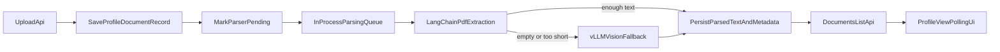

# PDF Parsing Module Plan

## Current Fit

The existing upload and delete flow already lives in [Backend/src/profileManagement/profileManagement.routes.js](Backend/src/profileManagement/profileManagement.routes.js), [Backend/src/profileManagement/pm.controller.js](Backend/src/profileManagement/pm.controller.js), and [Backend/src/profileManagement/pm.service.js](Backend/src/profileManagement/pm.service.js). Uploaded PDFs are already stored on disk via [Backend/src/profileManagement/pm.storage.js](Backend/src/profileManagement/pm.storage.js), and the frontend already fetches and renders document rows in [App/src/components/profile/ProfileView.jsx](App/src/components/profile/ProfileView.jsx).

The cleanest way to keep this separate is a new backend module folder such as [Backend/src/documentParsing/](Backend/src/documentParsing/) that is called from the current upload service, without moving the existing profile feature.

## Proposed Architecture

## Backend Changes

Add a new isolated module under [Backend/src/documentParsing/](Backend/src/documentParsing/) with small internal pieces:

- `queue` or `scheduler`: in-process async queue that starts work after upload response returns.
- `parser service`: orchestrates state changes `pending -> processing -> completed/failed`.
- `langchain loader adapter`: uses a LangChain PDF loader for embedded text extraction first.
- `vllm adapter`: calls an existing OpenAI-compatible, vision-capable vLLM endpoint when text extraction is missing or below a configurable threshold.
- `resume bootstrap`: on startup from [Backend/src/server.js](Backend/src/server.js), re-enqueue any documents still marked `pending` or `processing` so parser state survives restarts reasonably well in the current single-process architecture.

Wire the existing upload path in [Backend/src/profileManagement/pm.service.js](Backend/src/profileManagement/pm.service.js) so it:

- still creates the document record immediately,
- sets parser status to `pending` at creation time,
- returns the upload response without waiting for parsing,
- enqueues the new document ID for background parsing.

Wire the existing delete path in [Backend/src/profileManagement/pm.service.js](Backend/src/profileManagement/pm.service.js) so deleting a document also removes parsed text and parser metadata automatically.

## Data Model

Extend [Backend/prisma/schema.prisma](Backend/prisma/schema.prisma) in the smallest way that supports the feature without adding another large subsystem.

Recommended shape:

- Keep `ProfileDocument` as the main record.
- Add parser fields directly on `ProfileDocument` for `parserStatus`, `parsedText`, `extractionMethod`, `pageCount`, `parserError`, `parserStartedAt`, `parserCompletedAt`, `parserUpdatedAt`.
- Keep list endpoints selecting only UI-safe fields, not the full `parsedText` blob.

Why this shape:

- minimal API/service churn,
- easy cascade cleanup because document deletion already removes the row,
- easiest way to keep the current frontend contract centered around one document object.

## Frontend Changes

Update [App/src/components/profile/ProfileView.jsx](App/src/components/profile/ProfileView.jsx) and [App/src/lib/apiClient.js](App/src/lib/apiClient.js) so the document upload screen reflects parser progress.

Use the smallest notification/update mechanism that fits the current app:

- after upload, refresh the documents list immediately,
- while any document is `pending` or `processing`, poll the existing documents endpoint every few seconds,
- stop polling when all documents are `completed` or `failed`,
- show compact status labels for `pending`, `processing`, `completed`, and `failed`, plus a failure message when available.

This is lighter than adding a new global realtime channel, while still satisfying the requirement that the frontend is updated when parsing finishes.

## Config And Dependencies

Update [Backend/package.json](Backend/package.json) and [Backend/src/config/env.js](Backend/src/config/env.js) for:

- LangChain PDF parsing dependencies,
- PDF page rendering helpers if needed for image-based fallback,
- vLLM endpoint/model/timeout/min-text-threshold environment variables.

Assumptions for the plan:

- the vLLM endpoint already exists,
- it is OpenAI-compatible,
- it supports image input for OCR-style extraction.

## Verification

Add focused backend tests near [Backend/tests/auth.e2e.test.js](Backend/tests/auth.e2e.test.js) style, but targeted to profile documents, covering:

- upload returns immediately and persists `pending`,
- successful embedded-text extraction stores plain text and metadata,
- low-text PDFs trigger the vLLM fallback path,
- parser failures are stored as `failed` without breaking upload,
- deleting a document removes the stored file and parser data,
- list/get responses expose parser status cleanly for the frontend.

Add a lightweight frontend verification path for:

- upload shows pending state,
- polling advances to completed or failed,
- deletion removes the document row and no stale polling remains.
