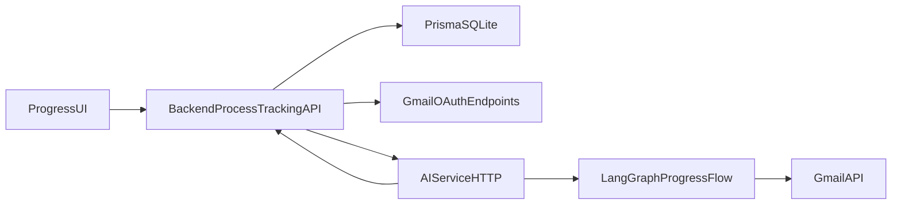

# LangGraph Gmail Progress Plan

## Existing Anchors

- Reuse the current backend-to-AI HTTP pattern from [F:/03_MyProgrames/02_StudentCarr_Vite/StudentCarr_vite/StudentCarr/StudentCarr/Backend/src/profileManagement/pm.service.js](F:/03_MyProgrames/02_StudentCarr_Vite/StudentCarr_vite/StudentCarr/StudentCarr/Backend/src/profileManagement/pm.service.js) and [F:/03_MyProgrames/02_StudentCarr_Vite/StudentCarr_vite/StudentCarr/StudentCarr/AIServices/src/generate_user_infomation.ts](F:/03_MyProgrames/02_StudentCarr_Vite/StudentCarr_vite/StudentCarr/StudentCarr/AIServices/src/generate_user_infomation.ts): the backend owns auth + Prisma, and `AIServices/` owns LangGraph and model calls.
- Replace the seed-only logic in [F:/03_MyProgrames/02_StudentCarr_Vite/StudentCarr_vite/StudentCarr/StudentCarr/Backend/src/processTracking/pt.service.js](F:/03_MyProgrames/02_StudentCarr_Vite/StudentCarr_vite/StudentCarr/StudentCarr/Backend/src/processTracking/pt.service.js) without breaking the route shell already mounted in [F:/03_MyProgrames/02_StudentCarr_Vite/StudentCarr_vite/StudentCarr/StudentCarr/Backend/src/processTracking/processTracking.routes.js](F:/03_MyProgrames/02_StudentCarr_Vite/StudentCarr_vite/StudentCarr/StudentCarr/Backend/src/processTracking/processTracking.routes.js).
- Keep the existing progress UI structure in [F:/03_MyProgrames/02_StudentCarr_Vite/StudentCarr_vite/StudentCarr/StudentCarr/App/src/components/progress/ProgressView.jsx](F:/03_MyProgrames/02_StudentCarr_Vite/StudentCarr_vite/StudentCarr/StudentCarr/App/src/components/progress/ProgressView.jsx) and related components, extending [F:/03_MyProgrames/02_StudentCarr_Vite/StudentCarr_vite/StudentCarr/StudentCarr/App/src/lib/apiClient.js](F:/03_MyProgrames/02_StudentCarr_Vite/StudentCarr_vite/StudentCarr/StudentCarr/App/src/lib/apiClient.js) with sync/Gmail endpoints.

## Target Architecture

## Implementation Steps

1. Extend [F:/03_MyProgrames/02_StudentCarr_Vite/StudentCarr_vite/StudentCarr/StudentCarr/Backend/prisma/schema.prisma](F:/03_MyProgrames/02_StudentCarr_Vite/StudentCarr_vite/StudentCarr/StudentCarr/Backend/prisma/schema.prisma) with user-owned Gmail linkage, sync state, tracked applications, stored emails, extracted intelligence, and reply draft/send records. Design for idempotency on Gmail message id and thread id, plus explicit processing timestamps and statuses.
2. Add backend Gmail auth/config support so authenticated users can connect a Gmail account and the backend can verify the Gmail identity matches the current app user. This includes new process-tracking endpoints for Gmail status, connect/start OAuth, callback completion, and disconnect/reconnect handling.
3. Refactor [F:/03_MyProgrames/02_StudentCarr_Vite/StudentCarr_vite/StudentCarr/StudentCarr/Backend/src/processTracking/pt.service.js](F:/03_MyProgrames/02_StudentCarr_Vite/StudentCarr_vite/StudentCarr/StudentCarr/Backend/src/processTracking/pt.service.js), [F:/03_MyProgrames/02_StudentCarr_Vite/StudentCarr_vite/StudentCarr/StudentCarr/Backend/src/processTracking/pt.controller.js](F:/03_MyProgrames/02_StudentCarr_Vite/StudentCarr_vite/StudentCarr/StudentCarr/Backend/src/processTracking/pt.controller.js), and [F:/03_MyProgrames/02_StudentCarr_Vite/StudentCarr_vite/StudentCarr/StudentCarr/Backend/src/processTracking/pt.schemas.js](F:/03_MyProgrames/02_StudentCarr_Vite/StudentCarr_vite/StudentCarr/StudentCarr/Backend/src/processTracking/pt.schemas.js) so the existing read endpoints become Prisma-backed and new sync/Gmail actions are added behind the same authenticated module.
4. Create a dedicated AI progress workflow under `AIServices/src/` that exposes explicit HTTP routes such as `/progress-tracking/sync`, `/progress-tracking/reply-draft`, and `/progress-tracking/send-reply`, plus `/health`. Either extend the existing AI server to host multiple routes or introduce a shared AI server entrypoint so profile generation and progress tracking can coexist without port conflicts.
5. Implement the LangGraph flow in `AIServices/src/` with clear nodes: load sync context, list candidate Gmail messages, cheap relevance filter, fetch full content, structured extraction via Zod, company+position application matching, persistence payload prep, draft generation for invite emails, and send-email execution after explicit user confirmation.
6. Keep Gmail API access out of the frontend. The backend should store encrypted or otherwise safely handled token material/reference, pass only the minimum needed account context to the AI service, and persist raw email data plus extracted fields so the UI can render without rerunning AI.
7. Update [F:/03_MyProgrames/02_StudentCarr_Vite/StudentCarr_vite/StudentCarr/StudentCarr/App/src/lib/apiClient.js](F:/03_MyProgrames/02_StudentCarr_Vite/StudentCarr_vite/StudentCarr/StudentCarr/App/src/lib/apiClient.js) and [F:/03_MyProgrames/02_StudentCarr_Vite/StudentCarr_vite/StudentCarr/StudentCarr/App/src/components/progress/ProgressView.jsx](F:/03_MyProgrames/02_StudentCarr_Vite/StudentCarr_vite/StudentCarr/StudentCarr/App/src/components/progress/ProgressView.jsx) to add a sync trigger, loading/error states, Gmail connection status messaging, and real reply-confirm behavior while preserving the current application/email/detail/reply panel flow.
8. Preserve business rules from the prompt: first sync reads only the last 7 days, later syncs read unread or unprocessed emails only, cheap metadata filtering happens before full-body fetch, applications are matched only when company and position align together, duplicate Gmail messages are ignored, and invite replies always require explicit user review before send.

## Key Design Decisions

- Prefer one persisted email record with raw Gmail fields plus a related extraction/reply state record rather than transient in-memory maps, because the current mock `sentReplyStore` cannot survive restarts.
- Preserve the current frontend response shape where practical so the UI components need minimal change even though the backing data source shifts from seeds to Prisma.
- Use the existing `requireAuth` gate in [F:/03_MyProgrames/02_StudentCarr_Vite/StudentCarr_vite/StudentCarr/StudentCarr/Backend/src/middleware/auth.middleware.js](F:/03_MyProgrames/02_StudentCarr_Vite/StudentCarr_vite/StudentCarr/StudentCarr/Backend/src/middleware/auth.middleware.js) as the ownership boundary for all Gmail-linked data.
- Treat Gmail OAuth and send-email as backend-owned concerns; `AIServices/` should handle workflow and classification logic, not browser-facing auth.

## Verification

- Run Prisma generate/migration successfully with the new progress/Gmail models.
- Start backend and AI service together and confirm both health endpoints work.
- Verify Gmail connect flow stores a valid linked account for the authenticated user.
- Confirm first sync only ingests recent 7-day messages, later syncs skip already processed mail, and duplicate message ids do not create duplicate records.
- Verify applications, email list, detail panel, draft generation, and reviewed send all work from the existing progress UI against database-backed data.
