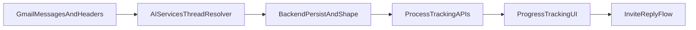

# Gmail Reply Thread Nesting Plan

## Scope

Implement the prompt in `langgraph_progress_tracking_gmail_update_reply_thread_nesting_prompt.md` by upgrading data model, sync pipeline, API contracts, and UI rendering so progress emails become thread-aware rather than flat.

## Current Baseline (From Code)

- Prisma stores `gmailThreadId` but no explicit parent/child relationship on `ProgressEmail`.
- Backend list endpoint returns flat emails for an application; detail endpoint returns one email without nested replies.
- AI sync is message-centric; extraction and draft generation run per message, not per conversation.
- Frontend list/detail components consume this flat shape directly.

## Implementation Strategy

### 1) Prisma + Migration

- Update [`f:/03_MyProgrames/02_StudentCarr_Vite/StudentCarr_vite/StudentCarr/StudentCarr/Backend/prisma/schema.prisma`](f:/03_MyProgrames/02_StudentCarr_Vite/StudentCarr_vite/StudentCarr/StudentCarr/Backend/prisma/schema.prisma):
  - Add reply/thread fields on `ProgressEmail`:
    - `rfcMessageId` (mapped column)
    - `inReplyTo` (mapped column)
    - `referencesHeader` (JSON mapped column)
    - `parentEmailId` self-reference + `parentEmail`/`childReplies` relation
    - optional deterministic thread-order field (e.g. timestamp or sequence) if needed for stable rendering
  - Add indexes for `gmailThreadId`, `rfcMessageId`, `parentEmailId` (retain existing unique on Gmail message id).
- Generate migration and ensure relation behavior is safe for incremental syncs (`onDelete: SetNull`).

### 2) AI Sync: Thread Reconstruction + Conversation Extraction

- Update [`f:/03_MyProgrames/02_StudentCarr_Vite/StudentCarr_vite/StudentCarr/StudentCarr/AIServices/src/progress_tracking_gmail.ts`](f:/03_MyProgrames/02_StudentCarr_Vite/StudentCarr_vite/StudentCarr/StudentCarr/AIServices/src/progress_tracking_gmail.ts):
  - Parse and normalize `Message-ID`, `In-Reply-To`, `References` from full-message headers.
  - Group fetched messages by `gmailThreadId` and sort chronologically.
  - Resolve parent links inside each thread:
    - primary: `In-Reply-To` / `References` lookup by normalized RFC message id
    - fallback: deterministic prior-message strategy within same Gmail thread when headers are missing/malformed
  - Shift extraction/classification/summary context to ordered conversation-level input while preserving per-message raw payload.
  - Ensure invite draft generation uses full conversation context for invite threads.
  - Extend sync output payload per message with persisted threading metadata (`rfcMessageId`, `inReplyTo`, `referencesHeader`, parent linkage hint, root/thread ordering metadata).

### 3) Backend Persistence + API Contract

- Update [`f:/03_MyProgrames/02_StudentCarr_Vite/StudentCarr_vite/StudentCarr/StudentCarr/Backend/src/processTracking/pt.service.js`](f:/03_MyProgrames/02_StudentCarr_Vite/StudentCarr_vite/StudentCarr/StudentCarr/Backend/src/processTracking/pt.service.js):
  - Persist new threading fields during sync upsert.
  - Implement idempotent parent linking that supports out-of-order arrival (child now, parent later) and re-link on subsequent syncs.
  - Keep application matching on company+position together, but apply thread-aware extraction result consistently to all thread messages.
  - Shape list endpoint data as root-only items (`parentEmailId == null`) for application email list.
  - Shape detail endpoint to return selected root email with nested replies in chronological order (recursive tree or ordered children list under `replies`).
- Update endpoint schemas/contracts in:
  - [`f:/03_MyProgrames/02_StudentCarr_Vite/StudentCarr_vite/StudentCarr/StudentCarr/Backend/src/processTracking/pt.schemas.js`](f:/03_MyProgrames/02_StudentCarr_Vite/StudentCarr_vite/StudentCarr/StudentCarr/Backend/src/processTracking/pt.schemas.js)
  - [`f:/03_MyProgrames/02_StudentCarr_Vite/StudentCarr_vite/StudentCarr/StudentCarr/Backend/src/processTracking/pt.controller.js`](f:/03_MyProgrames/02_StudentCarr_Vite/StudentCarr_vite/StudentCarr/StudentCarr/Backend/src/processTracking/pt.controller.js)
  - [`f:/03_MyProgrames/02_StudentCarr_Vite/StudentCarr_vite/StudentCarr/StudentCarr/Backend/src/processTracking/processTracking.routes.js`](f:/03_MyProgrames/02_StudentCarr_Vite/StudentCarr_vite/StudentCarr/StudentCarr/Backend/src/processTracking/processTracking.routes.js) (if validation/shape wiring requires route-adjacent updates).

### 4) Frontend: Root-Only List + Nested Detail Rendering

- Update [`f:/03_MyProgrames/02_StudentCarr_Vite/StudentCarr_vite/StudentCarr/StudentCarr/App/src/components/progress/ProgressView.jsx`](f:/03_MyProgrames/02_StudentCarr_Vite/StudentCarr_vite/StudentCarr/StudentCarr/App/src/components/progress/ProgressView.jsx):
  - Treat list response as roots-only source for selection.
  - Preserve selection through sync refresh when selected root still exists; reload detail including nested replies.
  - Keep invite flow wired to the canonical selected thread/root id.
- Update [`f:/03_MyProgrames/02_StudentCarr_Vite/StudentCarr_vite/StudentCarr/StudentCarr/App/src/components/progress/ProgressEmailList.jsx`](f:/03_MyProgrames/02_StudentCarr_Vite/StudentCarr_vite/StudentCarr/StudentCarr/App/src/components/progress/ProgressEmailList.jsx):
  - Render only root items from backend response.
  - Optionally show reply/thread count indicator if provided.
- Update [`f:/03_MyProgrames/02_StudentCarr_Vite/StudentCarr_vite/StudentCarr/StudentCarr/App/src/components/progress/ProgressEmailDetailPanel.jsx`](f:/03_MyProgrames/02_StudentCarr_Vite/StudentCarr_vite/StudentCarr/StudentCarr/App/src/components/progress/ProgressEmailDetailPanel.jsx):
  - Keep root email prominent.
  - Add nested replies section (chronological, visually distinct, sender/date/body/summary).
- Keep layout stable in [`f:/03_MyProgrames/02_StudentCarr_Vite/StudentCarr_vite/StudentCarr/StudentCarr/App/src/components/progress/ProgressApplicationItem.jsx`](f:/03_MyProgrames/02_StudentCarr_Vite/StudentCarr_vite/StudentCarr/StudentCarr/App/src/components/progress/ProgressApplicationItem.jsx) and [`f:/03_MyProgrames/02_StudentCarr_Vite/StudentCarr_vite/StudentCarr/StudentCarr/App/src/components/progress/InviteReplyPanel.jsx`](f:/03_MyProgrames/02_StudentCarr_Vite/StudentCarr_vite/StudentCarr/StudentCarr/App/src/components/progress/InviteReplyPanel.jsx).

### 5) Verification Checklist

- Prisma migration applies successfully.
- Sync persists new threading fields and parent links.
- Re-sync remains idempotent (no duplicate emails; parent links stabilize).
- Application email list excludes reply children.
- Email detail endpoint includes nested replies and ordering.
- UI shows root + nested replies correctly.
- Invite draft/confirm still works using thread-aware context.
- Conversation-aware extraction improves status/intent consistency for ambiguous latest-message cases.

## Execution Notes

- Keep architecture intact: frontend -> backend -> AIServices.
- Prefer backend-shaped response over frontend tree reconstruction heuristics.
- Handle edge cases explicitly: missing headers, out-of-order sync arrivals, selected email reassignment after later parent discovery.
