# Student Career Application - Use Case Diagram

```mermaid
graph TB
    subgraph Actors
        Student(["👤 Student"])
        AI(["🤖 AI System"])
    end

    subgraph AUTH["🔐 Authentication"]
        UC1["Login with Email & Password"]
        UC2["Logout"]
        UC3["View Demo Credentials"]
    end

    subgraph DASH["📊 Dashboard"]
        UC4["View Career Statistics"]
        UC5["View Recent Activity Feed"]
        UC6["Access Quick Actions"]
    end

    subgraph PROFILE["👤 Profile Management"]
        UC7["View Profile"]
        UC8["Edit Profile Information"]
        UC9["Upload Avatar"]
    end

    subgraph JOBS["💼 Job Discovery"]
        UC10["Browse Job Listings"]
        UC11["Search Jobs"]
        UC12["View Job Details"]
        UC13["View Job Matches"]
    end

    subgraph SKILLS["🎯 Skill Management"]
        UC14["View Skills Overview"]
        UC15["Perform Skill Gap Analysis"]
        UC16["Compare Skills vs Job Requirements"]
        UC17["Generate Learning Path"]
        UC18["View Personalized Study Plan"]
    end

    subgraph APPS["📋 Application Management"]
        UC19["View Applications Overview"]
        UC20["Build / Edit Resume"]
        UC21["Export Resume / CV"]
        UC22["Use Job Application Automation"]
        UC23["Track Application Status"]
    end

    subgraph PROGRESS["📈 Progress Tracking"]
        UC24["View Career Development Metrics"]
        UC25["Track Skill Completion Progress"]
        UC26["View Progress Visualizations"]
    end

    subgraph INTERVIEW["🎤 AI Interview Assistant"]
        UC27["Start Interview Practice Session"]
        UC28["Receive AI Feedback"]
        UC29["Review Interview Performance"]
    end

    %% Student connections
    Student --> UC1
    Student --> UC2
    Student --> UC3
    Student --> UC4
    Student --> UC5
    Student --> UC6
    Student --> UC7
    Student --> UC8
    Student --> UC9
    Student --> UC10
    Student --> UC11
    Student --> UC12
    Student --> UC13
    Student --> UC14
    Student --> UC15
    Student --> UC16
    Student --> UC17
    Student --> UC18
    Student --> UC19
    Student --> UC20
    Student --> UC21
    Student --> UC22
    Student --> UC23
    Student --> UC24
    Student --> UC25
    Student --> UC26
    Student --> UC27
    Student --> UC29

    %% AI System connections
    AI --> UC15
    AI --> UC17
    AI --> UC22
    AI --> UC28
    AI --> UC13

    UC27 --> UC28

    %% Styling
    classDef actor fill:#4A90D9,stroke:#2C5F8A,color:#fff,rx:50
    classDef usecase fill:#F5F5F5,stroke:#999,color:#333
    classDef aiActor fill:#7B68EE,stroke:#5A4DB0,color:#fff,rx:50
    class Student actor
    class AI aiActor
```

---

## Actor Descriptions

| Actor | Role |
|---|---|
| **Student** | The primary user of the application — a student managing their career journey |
| **AI System** | Background system that powers skill gap analysis, learning path generation, job matching, and interview feedback |

---

## Use Case Summary by Module

| Module | Use Cases |
|---|---|
| Authentication | Login, Logout, View Demo Credentials |
| Dashboard | View Statistics, View Activity Feed, Access Quick Actions |
| Profile Management | View/Edit Profile, Upload Avatar |
| Job Discovery | Browse Jobs, Search Jobs, View Job Details, View Matches |
| Skill Management | View Skills, Gap Analysis, Compare vs Requirements, Learning Path |
| Application Management | View Applications, Build Resume, Export CV, Automation, Track Status |
| Progress Tracking | View Metrics, Track Skills, View Visualizations |
| AI Interview Assistant | Practice Sessions, Receive AI Feedback, Review Performance |
